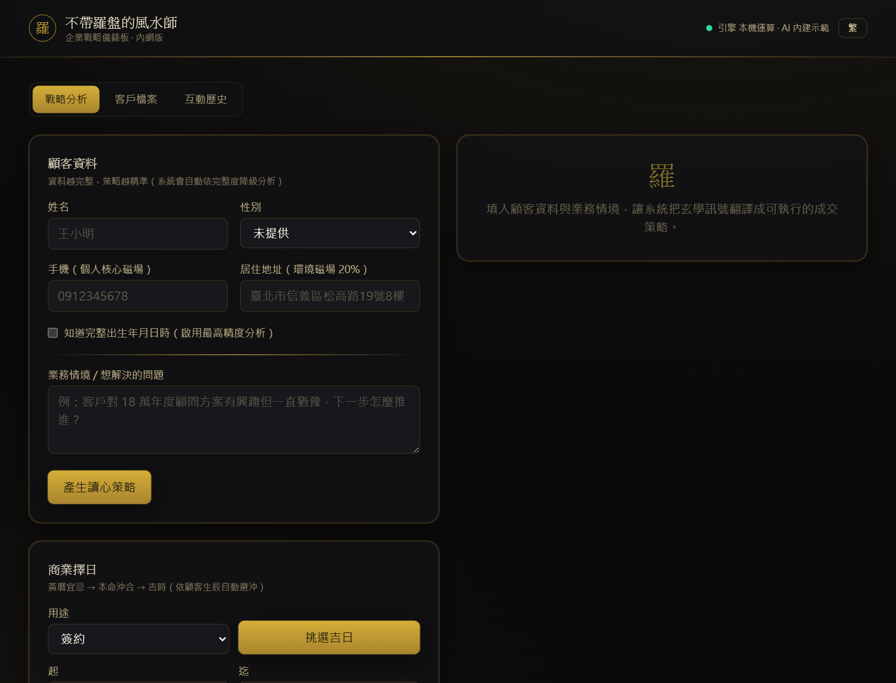
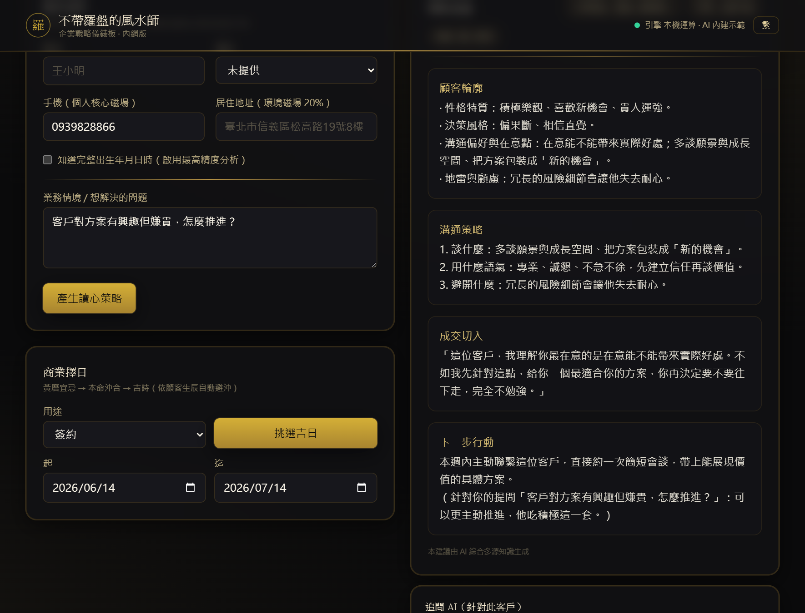
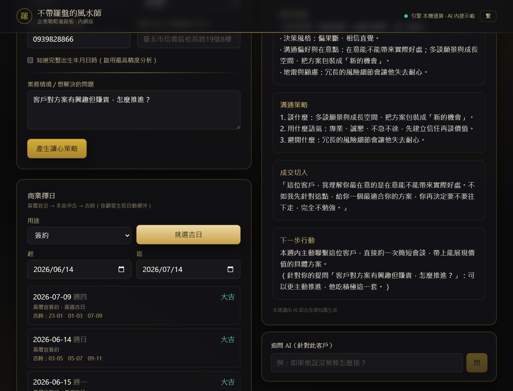
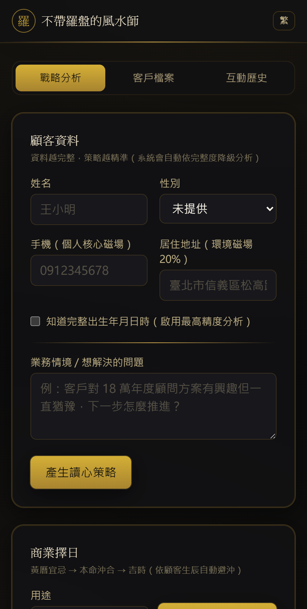

# 不帶羅盤的風水師 · CRM 體驗版 🧭


> 結合**東方玄學**與**現代行為科學**的 AI 業務 CRM。輸入顧客的姓名／手機／生辰，系統把命理訊號**翻譯成業務員可以直接照做的白話成交策略**——不丟一堆看不懂的八字術語，只給你「這個人怎麼談、怎麼成交」。

**這是開源體驗版**：純前後端、**零外部依賴、零金鑰、clone 即跑**。命理計算全在本機用 JavaScript 真實運算；AI 策略內建零設定示範產生器（想用真 AI 一行設定即可切 OpenAI / DeepSeek / Ollama）。

<p align="center"><i>黑金奢華主題 · 繁簡即時切換 · 逐字串流輸出</i></p>

## 📸 畫面

| 戰略分析 | AI 溝通建議 |
|---|---|
|  |  |
| **商業擇日** | **手機版** |
|  |  |

---

## ✨ 功能

| | 說明 |
|---|---|
| 🔮 **動態玄學路由** | 依資料完整度自動降級：完整生辰→**八字**；有姓名→**姓名學五格**；有手機→**數字易經磁場**；地址→環境磁場 |
| 🧠 **AI 溝通建議** | 把玄學訊號轉成 4 段白話策略：顧客輪廓 / 溝通策略 / 成交切入話術 / 下一步行動。**逐字串流輸出** |
| 👥 **客戶檔案管理** | 客戶 CRUD、搜尋、互動軌跡 |
| 💬 **追問對話** | 針對某客戶繼續問 AI（「他說沒預算怎麼接？」）|
| 📅 **商業擇日** | 黃曆宜忌 → 本命沖合 → 黃道吉時（真太陽時校正，台灣 22 縣市精確經度）|
| 🌏 **繁簡切換** | opencc 即時雙向，連 AI 輸出一起正規化 |
| 🎨 **黑金 RWD UI** | Nuxt 3 + Tailwind，手機/桌面皆可 |

> 命理引擎全部是**純 JS 真實運算**（非 mock）：數字易經八星磁場、八字四柱五行十神（lunar-javascript）、姓名學五格 81 數理三才、真太陽時、擇日漏斗。

---

## 🚀 快速開始

需求：**Node.js ≥ 20**

**一鍵啟動（推薦）** — 在根目錄裝一次、一條指令同時起前後端：
```bash
git clone https://github.com/m0989369498-svg/fengshui-crm.git && cd fengshui-crm
npm run setup     # 裝根目錄 + backend + frontend
npm run dev       # 同時啟動後端(:3001) + 前端(:3000)
```

或分開啟動（兩個終端機）：
```bash
cd backend  && npm install && npm start   # :3001
cd frontend && npm install && npm run dev  # :3000
```

打開 **http://localhost:3000** → 填姓名+手機+業務問題 → 按「產生溝通建議」。**完全零設定即可玩**（用內建示範 AI）。

### 一行切換成真 AI（選用）
在 `backend/.env`（從 `.env.example` 複製）設定其一：

```ini
# OpenAI
LLM_PROVIDER=openai
LLM_API_KEY=sk-...

# DeepSeek
LLM_PROVIDER=deepseek
LLM_API_KEY=sk-...

# 本機 Ollama（先 ollama pull qwen2.5:7b）
LLM_PROVIDER=ollama
LLM_MODEL=qwen2.5:7b
```
重啟後端即生效。沒設或沒金鑰時自動回退內建示範產生器，服務不中斷。

---

## 🏗️ 架構

```
frontend/ (Nuxt 3 :3000)                backend/ (Express :3001, 自包含)
  分頁: 分析 / 客戶 / 歷史                 ├─ engines/   純 JS 命理引擎
  ├─ 串流逐字策略                          │   shuziYijing · bazi · xingming
  ├─ 客戶管理 + 追問                       │   trueSolarTime · dateSelection
  ├─ 商業擇日                              ├─ services/  metaRouter · llmService · store
  └─ 繁簡(opencc)        ──/api 代理──►    ├─ mock/      零設定策略產生器
                                          └─ routes/    interaction · customers · calendar
                                          LLM: mock | openai | deepseek | ollama
```

無資料庫（JSONL 落地）、無遠端服務、無金鑰。所有運算在本機。

---

## 📂 專案結構
```
backend/
  src/engines/      數字易經 / 八字 / 姓名學 / 真太陽時 / 擇日（純 JS）
  src/services/     玄學路由 / LLM / 儲存 / 策略編排
  src/mock/         內建示範策略產生器
  src/routes/       REST API
  data/             kangxi_strokes.json（姓名筆畫）+ JSONL 落地
frontend/           Nuxt 3 黑金 UI
```

## 📜 API
- `POST /api/interaction/strategy-stream` — 串流策略（NDJSON）
- `POST /api/interaction/strategy` / `/followup` ｜ `GET /history`
- `GET/POST/PUT/DELETE /api/customers` — 客戶 CRUD
- `POST /api/calendar/select` — 擇日

---

## ⚠️ 免責聲明與授權

**使用須知**
- 本專案的命理演算法為**公有領域古法的通用實作**（八字四柱、姓名學五格 81 數理、數字易經八星、黃曆擇日），屬教學與技術示範用途。
- 本工具產生的是**溝通參考建議**，非事實陳述、非命運預測、非投資或醫療建議。**任何分析結果僅供參考，請理性看待，不應作為決策的唯一依據。**
- 本專案**不隨附任何第三方版權語料**。若你要接自己的知識庫（RAG），請自行確保所用語料的授權合法性。

**隱私**
- 體驗版所有運算與資料皆在你自己的機器上（JSONL 落地），開發者不會收到任何資料。
- 若你輸入他人的個人資料（姓名／電話／生辰），請確保已取得該當事人同意，並遵守你所在司法管轄區的個資法規。

**授權：MIT**（見 [LICENSE](LICENSE)）。歡迎 fork、PR、提 issue。
